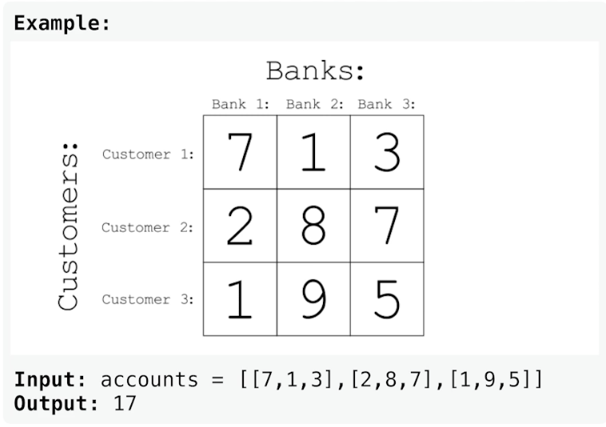

# 1672. Richest Customer Wealth


[1672. Richest Customer Wealth](https://leetcode.com/problems/richest-customer-wealth/description/)

You are given an `m x n` integer grid accounts where `accounts[i][j]` is the amount of money the `i^th`  customer has in
the `j^th` bank.
Return the **wealth** that the richest customer has.

A customer's **wealth** is the amount of money they have in all their bank accounts. The richest customer is the
customer that has the maximum **wealth**.

## Picture



## Example 1

> **Input**: accounts = `[[1,2,3],[3,2,1]]`  
> **Output**: `6`   
> **Explanation**:  
> 1st customer has wealth = `1 + 2 + 3 = 6`  
> 2nd customer has wealth = `3 + 2 + 1 = 6`   
> `Both customers are considered the richest with a wealth of 6 each, so return 6.`

## Example 2

> **Input**: accounts = `[[1,5],[7,3],[3,5]]`.   
> **Output**: `10`.  
> **Explanation**:  
> `1st customer has wealth = 6`.  
> `2nd customer has wealth = 10`.  
> `3rd customer has wealth = 8`.  
> `The 2nd customer is the richest with a wealth of 10.`

## Example 3

> **Input**: accounts = `[[2,8,7],[7,1,3],[1,9,5]]`.  
> **Output**: `17`.

## Constraints

> `m == accounts.length`.  
> `n == accounts[i].length`.  
> `1 <= m, n <= 50`.  
> `1 <= accounts[i][j] <= 100`.

## Code

```csharp
public static int Run(int[][] input)
{
    var max = input[0].Sum();

    for (var i = 1; i < input.Length; i++)
    {
        var calcMax = input[i].Sum();
        if (calcMax > max)
            max = calcMax;
    }

    return max;
}
```