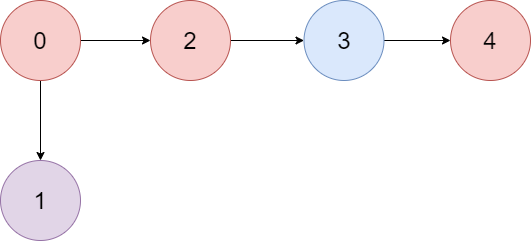

# 1857. Largest Color Value in a Directed Graph


[1857. Largest Color Value in a Directed Graph](https://leetcode.com/problems/largest-color-value-in-a-directed-graph/description/?envType=daily-question&envId=2025-05-26)

```
There is a directed graph of n colored nodes and m edges. The nodes are numbered from 0 to n - 1.

You are given a string colors where colors[i] is a lowercase English letter representing the color of the ith node in this graph (0-indexed). You are also given a 2D array edges where edges[j] = [aj, bj] indicates that there is a directed edge from node aj to node bj.

A valid path in the graph is a sequence of nodes x1 -> x2 -> x3 -> ... -> xk such that there is a directed edge from xi to xi+1 for every 1 <= i < k. The color value of the path is the number of nodes that are colored the most frequently occurring color along that path.

Return the largest color value of any valid path in the given graph, or -1 if the graph contains a cycle.
```

## Example 1

```
Input: colors = "abaca", edges = [[0,1],[0,2],[2,3],[3,4]]
Output: 3
Explanation: The path 0 -> 2 -> 3 -> 4 contains 3 nodes that are colored "a" (red in the above image).
```

## Example 2

```
Input: colors = "a", edges = [[0,0]]
Output: -1
Explanation: There is a cycle from 0 to 0.

```

## Constraints
```
n == colors.length
m == edges.length
1 <= n <= 10^5
0 <= m <= 10^5
colors consists of lowercase English letters.
0 <= aj, bj < n
```

## Code
```csharp
public int LargestPathValue(string colors, int[][] edges)
{
    int n = colors.Length;

    // 1. Построение графа и массива входящих степеней
    var graph = new List<int>[n];
    var indegree = new int[n];
    for (int i = 0; i < n; i++)
        graph[i] = new List<int>();

    foreach (var edge in edges)
    {
        int from = edge[0], to = edge[1];
        graph[from].Add(to);
        indegree[to]++;
    }

    // 2. Инициализация DP: dp[i][c] - макс. количество цвета c до вершины i
    var dp = new int[n][];
    for (int i = 0; i < n; i++)
        dp[i] = new int[26];

    var queue = new Queue<int>();

    // 3. Добавляем все вершины без входящих ребер (начальные точки)
    for (int i = 0; i < n; i++)
        if (indegree[i] == 0)
            queue.Enqueue(i);

    int visitedCount = 0;
    int maxColorValue = 0;

    // 4. Топологическая сортировка (Kahn’s algorithm)
    while (queue.Count > 0)
    {
        int node = queue.Dequeue();
        visitedCount++;

        // Увеличиваем счетчик для текущего цвета
        int colorIndex = colors[node] - 'a';
        dp[node][colorIndex]++;
        maxColorValue = Math.Max(maxColorValue, dp[node][colorIndex]);

        // Обновляем соседей
        foreach (int neighbor in graph[node])
        {
            for (int c = 0; c < 26; c++)
            {
                dp[neighbor][c] = Math.Max(dp[neighbor][c], dp[node][c]);
            }

            indegree[neighbor]--;
            if (indegree[neighbor] == 0)
                queue.Enqueue(neighbor);
        }
    }

    // Если остались непосещенные вершины — значит, в графе цикл
    return visitedCount == n ? maxColorValue : -1;
}
```

## Complexity
> **Time complexity**: O(M + N)  
> **Space complexity**: O(1)