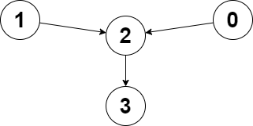

# 2359. Find Closest Node to Given Two Nodes


[2359. Find Closest Node to Given Two Nodes](https://leetcode.com/problems/find-closest-node-to-given-two-nodes/description/?envType=daily-question&envId=2025-05-30)

```
You are given a directed graph of n nodes numbered from 0 to n - 1, where each node has at most one outgoing edge.

The graph is represented with a given 0-indexed array edges of size n, indicating that there is a directed edge from node i to node edges[i]. If there is no outgoing edge from i, then edges[i] == -1.

You are also given two integers node1 and node2.

Return the index of the node that can be reached from both node1 and node2, such that the maximum between the distance from node1 to that node, and from node2 to that node is minimized. If there are multiple answers, return the node with the smallest index, and if no possible answer exists, return -1.

Note that edges may contain cycles.
```

## Example 1



```
Input: edges = [2,2,3,-1], node1 = 0, node2 = 1
Output: 2
Explanation: The distance from node 0 to node 2 is 1, and the distance from node 1 to node 2 is 1.
The maximum of those two distances is 1. It can be proven that we cannot get a node with a smaller maximum distance than 1, so we return node 2.
```

## Example 2


```
Input: edges = [1,2,-1], node1 = 0, node2 = 2
Output: 2
Explanation: The distance from node 0 to node 2 is 2, and the distance from node 2 to itself is 0.
The maximum of those two distances is 2. It can be proven that we cannot get a node with a smaller maximum distance than 2, so we return node 2.
```

## Constraints

```
n == edges.length
2 <= n <= 10^5
-1 <= edges[i] < n
edges[i] != i
0 <= node1, node2 < n
```

## Code

```csharp
public int ClosestMeetingNode(int[] edges, int node1, int node2)
{
    var d1 = Bfs(edges, node1);
    var d2 = Bfs(edges, node2);
    
    int result = -1;
    int minMaxDist = int.MaxValue;

    for (int i = 0; i < edges.Length; i++)
    {
        if (d1[i] != -1 && d2[i] != -1)
        {
            int maxDist = Math.Max(d1[i], d2[i]);
            if (maxDist < minMaxDist || (maxDist == minMaxDist && i < result))
            {
                minMaxDist = maxDist;
                result = i;
            }
        }
    }

    return result;
}

private static int[] Bfs(int[] edges, int start)
{
    var queue = new Queue<int>();
    var visited = new HashSet<int>();
    var result = new int[edges.Length];
    Array.Fill(result, -1);
    
    queue.Enqueue(start);
    visited.Add(start);
    result[start] = 0;
    
    var length = 0;
    while (queue.TryDequeue(out var current))
    {
        length++;
        
        if (edges[current] == -1)
        {
            return result;
        }
        
        var next = edges[current];
        if (!visited.Contains(next))
        {
            result[next] = length;
            
            queue.Enqueue(next);
            visited.Add(next);
        }
    }
    
    return result;
}
```

## Complexity

> **Time complexity**: O(n)  
> **Space complexity**: O(n)