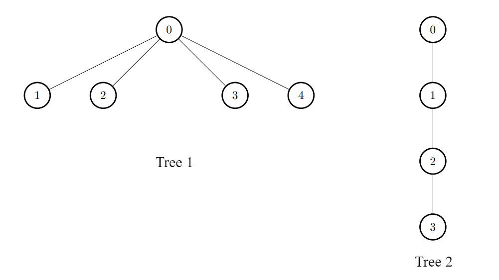

# 3372. Maximize the Number of Target Nodes After Connecting Trees I


[3372. Maximize the Number of Target Nodes After Connecting Trees I](https://leetcode.com/problems/maximize-the-number-of-target-nodes-after-connecting-trees-i/description/?envType=daily-question&envId=2025-05-28)

```
There exist two undirected trees with n and m nodes, 
with distinct labels in ranges [0, n - 1] and [0, m - 1], respectively.

You are given two 2D integer arrays edges1 and 
edges2 of lengths n - 1 and m - 1, 
respectively, where edges1[i] = [ai, bi] indicates that 
there is an edge between nodes ai and bi in the first tree and edges2[i] = [ui, vi] indicates that there is an edge between nodes ui and vi in the second tree. 
You are also given an integer k.

Node u is target to node v if the number of edges on the path 
from u to v is less than or equal to k. 
Note that a node is always target to itself.

Return an array of n integers answer, 
where answer[i] is the maximum possible number of nodes target to node i of the first tree 
if you have to connect one node from the first tree to another node in the second tree.

Note that queries are independent from each other. 
That is, for every query you will remove the added edge before proceeding to the next query.
```

## Example 1

```
Input: edges1 = [[0,1],[0,2],[2,3],[2,4]], edges2 = [[0,1],[0,2],[0,3],[2,7],[1,4],[4,5],[4,6]], k = 2

Output: [9,7,9,8,8]

Explanation:

For i = 0, connect node 0 from the first tree to node 0 from the second tree.
For i = 1, connect node 1 from the first tree to node 0 from the second tree.
For i = 2, connect node 2 from the first tree to node 4 from the second tree.
For i = 3, connect node 3 from the first tree to node 4 from the second tree.
For i = 4, connect node 4 from the first tree to node 4 from the second tree.
```

## Example 2

```
Input: edges1 = [[0,1],[0,2],[0,3],[0,4]], edges2 = [[0,1],[1,2],[2,3]], k = 1

Output: [6,3,3,3,3]

Explanation:

For every i, connect node i of the first tree with any node of the second tree.
```

## Constraints
```
2 <= n, m <= 1000
edges1.length == n - 1
edges2.length == m - 1
edges1[i].length == edges2[i].length == 2
edges1[i] = [ai, bi]
0 <= ai, bi < n
edges2[i] = [ui, vi]
0 <= ui, vi < m
The input is generated such that edges1 and edges2 represent valid trees.
0 <= k <= 1000
```

## Code
```csharp
public class Solution {
    public int[] MaxTargetNodes(int[][] edges1, int[][] edges2, int k) {
        var g2 = Build(edges2);
        int m = edges2.Length + 1;
        int t = 0;

        for (int i = 0; i < m; i++) {
            t = Math.Max(t, Dfs(g2, i, -1, k - 1));
        }

        var g1 = Build(edges1);
        int n = edges1.Length + 1;
        var ans = new int[n];
        Array.Fill(ans, t);

        for (int i = 0; i < n; i++) {
            ans[i] += Dfs(g1, i, -1, k);
        }

        return ans;
    }

    private List<int>[] Build(int[][] edges) {
        int n = edges.Length + 1;
        var g = new List<int>[n];
        for (int i = 0; i < n; i++) {
            g[i] = new List<int>();
        }
        foreach (var e in edges) {
            int a = e[0], b = e[1];
            g[a].Add(b);
            g[b].Add(a);
        }
        return g;
    }

    private int Dfs(List<int>[] g, int a, int fa, int d) {
        if (d < 0) {
            return 0;
        }
        int cnt = 1;
        foreach (var b in g[a]) {
            if (b != fa) {
                cnt += Dfs(g, b, a, d - 1);
            }
        }
        return cnt;
    }
}
```

## Complexity
> **Time complexity**: O()  
> **Space complexity**: O()