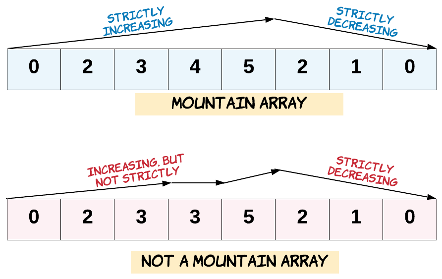

# 941. Valid Mountain Array


[941. Valid Mountain Array](https://leetcode.com/problems/valid-mountain-array/description/)

Given an array of integers `arr`, return `true` if and only if it is a valid mountain array.

Recall that `arr` is a mountain array if and only if:

- `arr.length >= 3`
- There exists some `i` with `0 < i < arr.length - 1` such that:
    - `arr[0] < arr[1] < ... < arr[i - 1] < arr[i]`
    - `arr[i] > arr[i + 1] > ... > arr[arr.length - 1]`

## Picture



## Example 1

> **Input**: `arr = [2,1]`  
> **Output**: `false`

## Example 2

> **Input**: `arr = [3,5,5]`  
> **Output**: `false`

## Example 3

> **Input**: `arr = [0,3,2,1]`
> **Output**: `true`

## Constraints

> `0 <= num <= 10^6`

## Code

```csharp
// 1st
public bool ValidMountainArray(int[] arr)
{
    if (arr.Length < 3) return false;

    var peak = 0;
    for (var i = 1; i < arr.Length; i++)
        if (arr[i - 1] < arr[i])
            peak = i;
        else
            break;

    if (peak == 0 || peak == arr.Length - 1) return false;

    for (var j = peak + 1; j < arr.Length; j++)
        if (arr[j-1] <= arr[j])
            return false;

    return true;
}

// 2nd 
public bool ValidMountainArray(int[] arr)
{
    if (arr.Length < 3)
        return false;

    var left = 0;
    var right = arr.Length - 1;

    while (left < right && left + 1 < arr.Length && right - 1 > 0)
    {
        var change = false;
        
        if (arr[left] == arr[left + 1] || arr[right] == arr[right - 1])
            return false;
        
        if (arr[left] < arr[left + 1])
        {
            left++;
            change = true;
        }
        
        if(arr[right - 1] > arr[right])
        {
            right--;
            change = true;
        }

        if (!change)
            return false;
    }

    return left == right && left != 0 && right != arr.Length - 1;
}
```